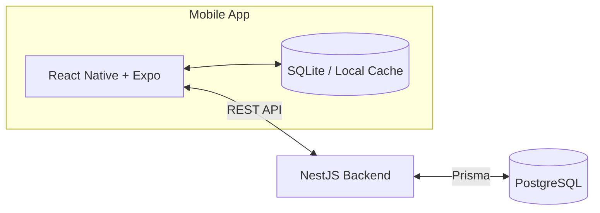

# CampusSpace

> A smart campus room availability and reservation system.

## Overview

CampusSpace is a planned cross-platform mobile application designed to help students:

- Find campus rooms.
- Check room availability for a selected date and time.
- Filter rooms by capacity and available facilities.
- Reserve suitable rooms.
- Avoid scheduling conflicts.
- View and manage their reservations.

The project is intended to explore real-world mobile development, backend architecture, database design, and the business logic required for a reliable reservation system.

## Problem

Students may have difficulty knowing which campus rooms are available or suitable for individual and group activities. Room details, schedules, and availability can be distributed across different sources, making it inefficient to discover an appropriate space and arrange a reservation.

## Proposed Solution

CampusSpace will provide a simple, schedule-aware reservation flow:

```text
Search by date and time
        ↓
View available rooms
        ↓
Filter by capacity and facilities
        ↓
View room details
        ↓
Create a reservation
        ↓
Backend validates availability
        ↓
Reservation confirmed
        ↓
QR check-in (later development phase)
```

## Key Features

All features below are currently planned; implementation has not started.

### Core / MVP

- Authentication
- Room listing
- Room details
- Date and time selection
- Schedule-aware room availability
- Capacity and facility filters
- Reservation creation
- Booking conflict prevention
- My Reservations
- Reservation cancellation
- Local data caching

### Planned / Advanced

- QR-based room check-in
- Automatic release of no-show reservations
- Real-time room availability updates
- Push notifications
- Room maintenance and blocking status
- Room usage history
- Smart room recommendations

## Technical Challenges

CampusSpace is intended to address several practical engineering problems:

- Detecting overlapping reservations accurately.
- Preventing concurrent users from double-booking a room.
- Enforcing booking rules and final availability checks on the server.
- Synchronizing state between the mobile application and backend API.
- Supporting local caching and graceful handling of network failures.
- Managing the reservation lifecycle, including confirmation, cancellation, check-in, expiration, and no-shows.
- Implementing secure authentication and role-based authorization.
- Integrating QR codes and device capabilities for future check-in workflows.

## Tech Stack

The following stack is planned and has not yet been added to the repository.

| Area | Planned technologies |
| --- | --- |
| Mobile | React Native, Expo, TypeScript |
| Backend | NestJS, TypeScript, Prisma |
| Database | PostgreSQL (server), SQLite (mobile/local persistence) |
| Development | Git, GitHub, Android Studio Emulator, Postman or Bruno |

## Architecture

The planned architecture separates the mobile client, local cache, backend API, and primary database:



The mobile application will use SQLite for local persistence and cached data. The NestJS backend will remain the authoritative source for reservations and communicate with PostgreSQL through Prisma.

## Reservation Logic

A new reservation conflicts with an existing reservation for the same room when both conditions are true:

```text
newStart < existingEnd
AND
newEnd > existingStart
```

This rule detects partial overlaps, reservations contained within another reservation, and reservations that contain an existing booking. Adjacent reservations—where one starts exactly when another ends—do not conflict under this rule.

The mobile client may perform an early availability check for a responsive user experience, but the final conflict validation must happen on the backend. Server-side validation is necessary because availability can change between the initial search and reservation submission.

## Planned Database Entities

The initial domain model is expected to include:

- `User`
- `Room`
- `Facility`
- `RoomFacility`
- `ClassSchedule`
- `Reservation`
- `CheckIn`
- `RoomBlock`
- `Notification`

These entities are conceptual and may evolve as requirements and reservation rules are refined.

## Project Structure

The repository is currently empty except for this README. The planned monorepo structure is:

```text
campus-space/
├── mobile/
├── server/
├── docs/
└── README.md
```

## Development Roadmap

1. **Phase 1 — Research, requirements, and UI flow**
2. **Phase 2 — Mobile UI and navigation**
3. **Phase 3 — State management and local persistence**
4. **Phase 4 — NestJS API and PostgreSQL integration**
5. **Phase 5 — Reservation and conflict logic**
6. **Phase 6 — QR check-in and notifications**
7. **Phase 7 — Testing, APK build, and release**

## Learning Objectives

Through this project, I aim to learn and practise:

- Mobile application development.
- React Native architecture.
- TypeScript.
- API integration.
- Backend development with NestJS.
- PostgreSQL database modelling.
- Mobile local persistence.
- Authentication and authorization.
- Software testing.
- Git and GitHub workflows.
- Deployment and release of an Android APK.

## Status

This project is currently under active development as part of a university mobile programming course.

The application is in the planning stage and is not production-ready.

## Author

Developed as a Computer Science mobile development project.

## License

License information will be added later.
