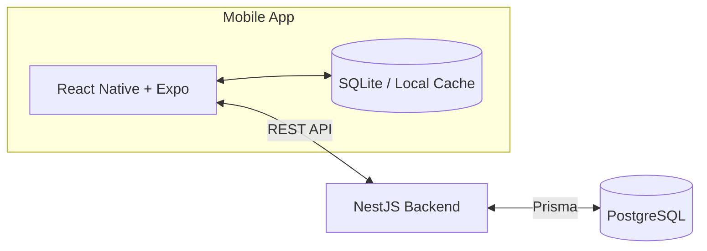

# CampusSpace

> A smart campus room availability and reservation system.

## Overview

CampusSpace is an Android-focused mobile application designed to help students:

- Find campus rooms.
- Check room availability for a selected date and time.
- Filter rooms by capacity and available facilities.
- Reserve suitable rooms.
- Avoid scheduling conflicts.
- View and manage their reservations.

The project is intended to explore real-world mobile development, backend architecture, database design, and the business logic required for a reliable reservation system.

## Problem

Students may have difficulty knowing which campus rooms are available or suitable for individual and group activities. Room details, schedules, and availability can be distributed across different sources, making it inefficient to discover an appropriate space and arrange a reservation.

## Proposed Solution

CampusSpace will provide a simple, schedule-aware reservation flow:

```text
Search by date and time
        ↓
View available rooms
        ↓
Filter by capacity and facilities
        ↓
View room details
        ↓
Create a reservation
        ↓
Backend validates availability
        ↓
Reservation confirmed
        ↓
QR check-in (later development phase)
```

## Ruang Lingkup Proyek (12 Pertemuan)

Bagian ini menetapkan ruang lingkup CampusSpace yang realistis untuk dikerjakan selama 12 pertemuan. Fokus pengembangan adalah alur utama pencarian ruang dan reservasi; fitur lanjutan tetap menjadi rencana pengembangan setelah MVP selesai.

### Deskripsi Masalah

Mahasiswa sering kesulitan mengetahui ruang kampus yang tersedia dan sesuai untuk belajar atau melakukan kegiatan kelompok pada waktu tertentu. Informasi ruang, kapasitas, fasilitas, dan jadwal penggunaan dapat tersebar di beberapa sumber sehingga mahasiswa perlu mencari dan mencocokkannya secara manual. CampusSpace dirancang untuk menyatukan informasi tersebut dan menyediakan proses reservasi yang memeriksa benturan jadwal.

### Profil Target Pengguna

Target pengguna utama CampusSpace adalah mahasiswa yang membutuhkan ruang kampus untuk belajar mandiri, diskusi kelompok, rapat organisasi, atau kegiatan akademik lainnya. Pengguna diasumsikan memiliki perangkat Android, akun yang dapat digunakan untuk masuk, serta akses internet untuk mencari ketersediaan dan membuat reservasi.

### Manfaat Aplikasi

- Mempermudah mahasiswa menemukan ruang yang sesuai tanpa memeriksa banyak sumber informasi.
- Menampilkan ketersediaan ruang berdasarkan tanggal dan waktu yang dipilih.
- Membantu pengguna memilih ruang berdasarkan kapasitas dan fasilitas yang dibutuhkan.
- Mengurangi risiko reservasi ganda melalui validasi jadwal pada backend.
- Menyediakan satu tempat untuk melihat dan mengelola reservasi milik pengguna.

### Daftar Fitur Inti

Fitur berikut menjadi target MVP selama 12 pertemuan:

- Autentikasi pengguna dasar.
- Daftar ruang dan detail ruang.
- Pemilihan tanggal serta rentang waktu.
- Pencarian ketersediaan yang mempertimbangkan jadwal kelas dan reservasi yang sudah ada.
- Filter berdasarkan kapasitas dan fasilitas.
- Pembuatan reservasi dengan validasi konflik pada backend.
- Halaman **My Reservations** untuk melihat reservasi pengguna.
- Pembatalan reservasi.
- Penyimpanan lokal untuk data penting dan penanganan dasar ketika jaringan bermasalah.

### Fitur yang Tidak Dikerjakan

Fitur berikut tidak termasuk dalam target 12 pertemuan dan hanya menjadi rencana pengembangan lanjutan:

- Check-in menggunakan QR code.
- Pelepasan reservasi otomatis ketika pengguna tidak hadir.
- Pembaruan ketersediaan ruang secara real-time.
- Push notification.
- Pengelolaan status pemeliharaan atau pemblokiran ruang melalui aplikasi admin.
- Riwayat penggunaan ruang dan analitik.
- Rekomendasi ruang cerdas.
- Integrasi dengan sistem akademik kampus yang sebenarnya.
- Rilis produksi untuk iOS atau publikasi ke app store.

### Kriteria Aplikasi Dinyatakan Berhasil

MVP CampusSpace dinyatakan berhasil apabila skenario berikut dapat didemonstrasikan pada perangkat Android atau emulator:

1. Pengguna dapat masuk ke aplikasi dan melihat daftar serta detail ruang.
2. Pengguna dapat memilih tanggal dan waktu, lalu memfilter ruang berdasarkan kapasitas atau fasilitas.
3. Sistem hanya menampilkan ruang yang tidak memiliki benturan dengan jadwal kelas atau reservasi lain pada waktu yang dipilih.
4. Reservasi yang valid dapat disimpan dan ditampilkan pada halaman **My Reservations**.
5. Backend menolak reservasi yang waktunya bertabrakan untuk ruang yang sama.
6. Pengguna dapat membatalkan reservasi miliknya dan status ketersediaan diperbarui dengan benar.
7. Aplikasi menangani kegagalan jaringan secara wajar tanpa berhenti secara tiba-tiba serta dapat menggunakan data penting yang telah disimpan secara lokal.
8. Alur utama—masuk, mencari ruang, membuat reservasi, melihat reservasi, dan membatalkan reservasi—dapat diselesaikan tanpa kesalahan yang menghalangi pengguna.

## Key Features

The MVP features below are implemented on the `dev` branch and are being prepared for Android device acceptance testing.

### Core / MVP

- Authentication
- Room listing
- Room details
- Date and time selection
- Schedule-aware room availability
- Capacity and facility filters
- Reservation creation
- Booking conflict prevention
- My Reservations
- Reservation cancellation
- Local data caching

### Planned / Advanced

- QR-based room check-in
- Automatic release of no-show reservations
- Real-time room availability updates
- Push notifications
- Room maintenance and blocking status
- Room usage history
- Smart room recommendations

## Technical Challenges

CampusSpace is intended to address several practical engineering problems:

- Detecting overlapping reservations accurately.
- Preventing concurrent users from double-booking a room.
- Enforcing booking rules and final availability checks on the server.
- Synchronizing state between the mobile application and backend API.
- Supporting local caching and graceful handling of network failures.
- Managing the reservation lifecycle, including confirmation, cancellation, check-in, expiration, and no-shows.
- Implementing secure authentication and role-based authorization.
- Integrating QR codes and device capabilities for future check-in workflows.

## Tech Stack

| Area | Technologies |
| --- | --- |
| Mobile | React Native, Expo, TypeScript |
| Backend | NestJS, TypeScript, Prisma |
| Database | PostgreSQL (server), SQLite (mobile/local persistence) |
| Development | Git, GitHub, Android Studio Emulator, Postman or Bruno |

## Architecture

The architecture separates the mobile client, local cache, backend API, and primary database:



The mobile application will use SQLite for local persistence and cached data. The NestJS backend will remain the authoritative source for reservations and communicate with PostgreSQL through Prisma.

## Reservation Logic

A new reservation conflicts with an existing reservation for the same room when both conditions are true:

```text
newStart < existingEnd
AND
newEnd > existingStart
```

This rule detects partial overlaps, reservations contained within another reservation, and reservations that contain an existing booking. Adjacent reservations—where one starts exactly when another ends—do not conflict under this rule.

The mobile client may perform an early availability check for a responsive user experience, but the final conflict validation must happen on the backend. Server-side validation is necessary because availability can change between the initial search and reservation submission.

## Database Entities

The implemented MVP domain model includes:

- `User`
- `Room`
- `Facility`
- `RoomFacility`
- `ClassSchedule`
- `Reservation`

`CheckIn`, `RoomBlock`, and `Notification` remain outside the MVP.

These entities may evolve as requirements and reservation rules are refined.

## Project Structure

The repository uses this lightweight monorepo structure:

```text
campus-space/
├── mobile/                 # Expo / React Native Android client
├── server/                 # NestJS API, Prisma schema, migrations, seed
├── docs/                   # Architecture, ADRs, plans, testing guide
├── docker-compose.yml      # Local PostgreSQL and API
└── README.md
```

## Development Roadmap

1. **Phase 1 — Research, requirements, and UI flow**
2. **Phase 2 — Mobile UI and navigation**
3. **Phase 3 — State management and local persistence**
4. **Phase 4 — NestJS API and PostgreSQL integration**
5. **Phase 5 — Reservation and conflict logic**
6. **Phase 6 — QR check-in and notifications**
7. **Phase 7 — Testing, APK build, and release**

## Learning Objectives

Through this project, I aim to learn and practise:

- Mobile application development.
- React Native architecture.
- TypeScript.
- API integration.
- Backend development with NestJS.
- PostgreSQL database modelling.
- Mobile local persistence.
- Authentication and authorization.
- Software testing.
- Git and GitHub workflows.
- Deployment and release of an Android APK.

## Status

This project is currently under active development as part of a university mobile programming course.

The MVP application, API, database migration, seed data, Docker environment, and automated checks are implemented. Local API integration and concurrent-booking protection have been verified. A hosted HTTPS API, EAS project linkage, signed APK build, and physical-device acceptance test still require the project owner's deployment and Expo accounts, so the project is not yet production-ready.

For local setup and Android testing, see [`docs/testing-guide.md`](docs/testing-guide.md). For the remaining route to an installable APK, see [`docs/implementation-plan.md`](docs/implementation-plan.md).

## Author

Developed as a Computer Science mobile development project.

## License

License information will be added later.
