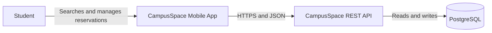
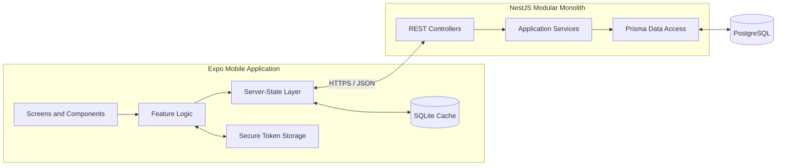
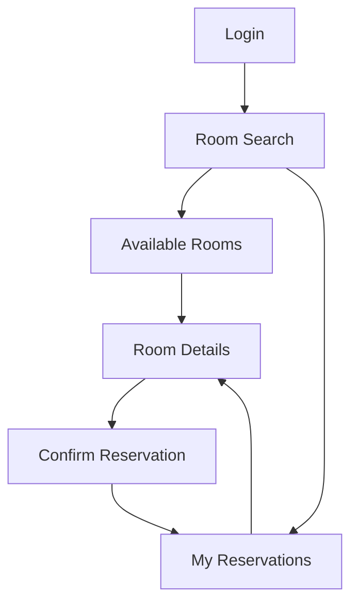
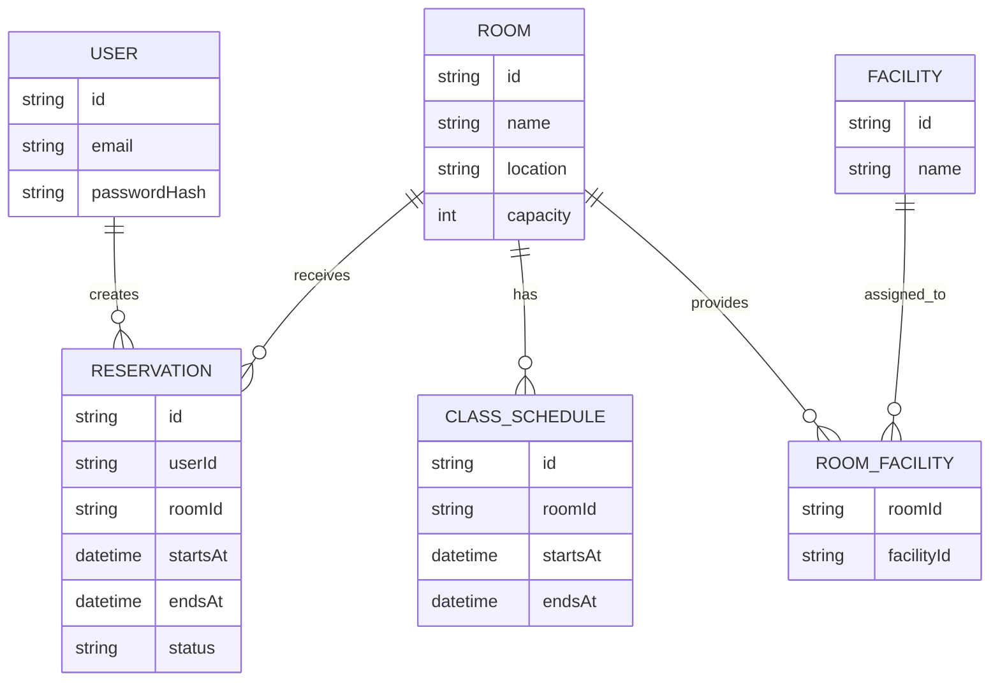
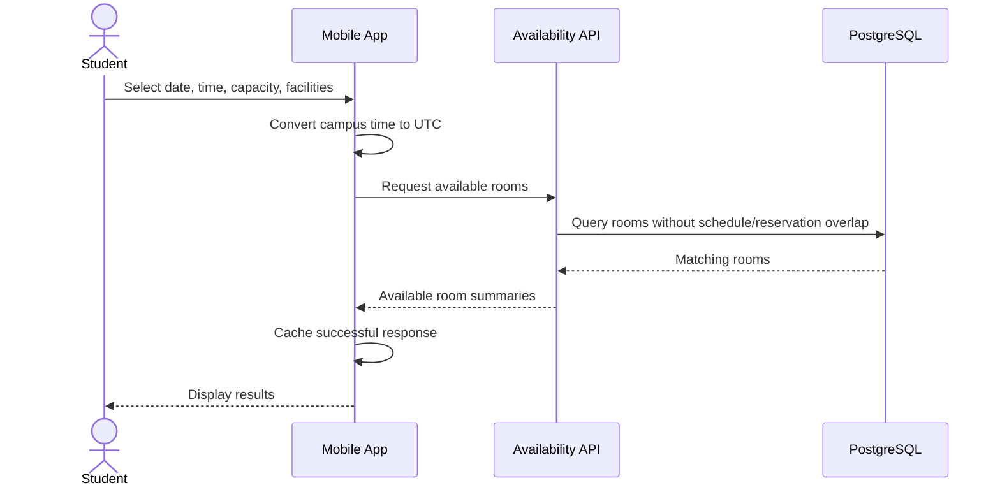
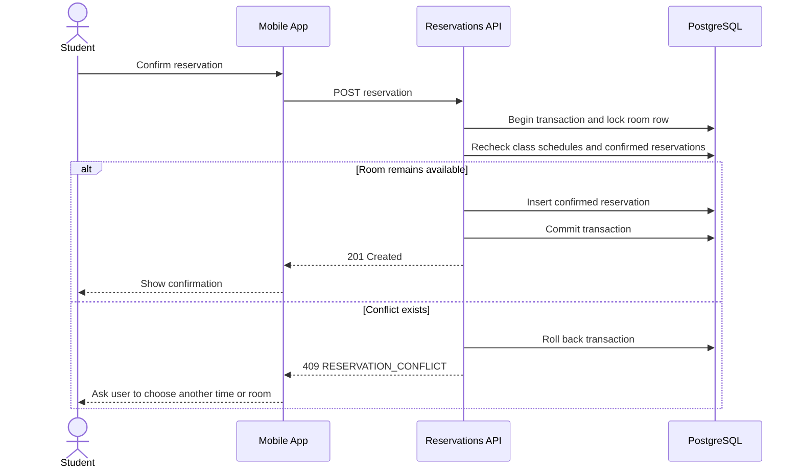

# CampusSpace Architecture Plan

## Document Status

This document describes the planned architecture for the CampusSpace minimum viable product (MVP). The repository is currently in the planning stage; the components, interfaces, and data models below are design decisions, not completed functionality.

The MVP is scoped for a 12-meeting university mobile programming course. Its primary goal is to deliver a reliable end-to-end flow for finding an available campus room and managing a reservation.

## 1. Goals and Constraints

### Architecture Goals

- Keep the mobile and backend codebases understandable for a student project.
- Make PostgreSQL and the backend the authoritative source for availability and reservations.
- Prevent double bookings even when multiple users reserve the same room concurrently.
- Allow the mobile app to display useful cached data during temporary network failures.
- Separate business rules from UI and transport concerns so they can be tested independently.
- Leave clear extension points for QR check-in, notifications, and real-time updates after the MVP.

### MVP Constraints

- Android is the primary demonstration platform.
- The system uses seeded campus rooms, facilities, class schedules, and demo user accounts.
- All booking and cancellation operations require a network connection.
- The project uses a modular monolith rather than independently deployed microservices.
- Timestamps are stored in UTC and displayed in the campus timezone, `Asia/Jakarta`.
- PostgreSQL is the source of truth; SQLite is only a mobile cache.

### Non-Goals for the 12-Meeting MVP

- QR-based check-in and automatic no-show release
- Real-time availability subscriptions
- Push notifications
- A room-management or maintenance administration application
- Usage analytics and smart room recommendations
- Integration with a real campus academic or identity system
- Offline creation or synchronization of reservations
- Public iOS or app-store release

## 2. Architecture Overview

CampusSpace uses a client-server architecture. The Expo mobile application communicates with a versioned NestJS REST API. The backend owns authentication, availability rules, authorization, and reservation conflict detection. Prisma provides access to PostgreSQL. SQLite stores selected mobile data for faster loading and limited offline viewing.

### System Context



### Container Architecture



## 3. Planned Repository Structure

```text
campus-space/
├── mobile/
│   ├── app/                 # Expo Router routes
│   ├── src/
│   │   ├── components/      # Shared presentation components
│   │   ├── features/        # Auth, rooms, availability, reservations
│   │   ├── lib/             # API client, query client, date utilities
│   │   ├── storage/         # SQLite cache and SecureStore adapters
│   │   └── types/           # Mobile-facing domain and API types
│   └── package.json
├── server/
│   ├── prisma/
│   │   ├── schema.prisma
│   │   ├── migrations/
│   │   └── seed.ts
│   ├── src/
│   │   ├── auth/
│   │   ├── rooms/
│   │   ├── availability/
│   │   ├── reservations/
│   │   ├── prisma/
│   │   └── common/
│   └── package.json
├── docs/
│   └── architecture-plan.md
└── README.md
```

The mobile and server applications remain separate TypeScript projects. Shared types should not be extracted into a third package during the MVP unless duplication becomes a concrete maintenance problem.

## 4. Mobile Architecture

### Responsibilities

The mobile application is responsible for:

- Authentication UI and secure token storage.
- Room browsing, date/time selection, and filters.
- Calling the API and presenting loading, empty, success, stale, and error states.
- Caching room data and the most recent reservation list in SQLite.
- Converting user-selected local times to UTC before sending them to the API.
- Refreshing affected queries after a reservation is created or cancelled.

The mobile application must not be the final authority for room availability. Client-side checks improve feedback but do not replace backend validation.

### Planned Mobile Libraries

| Concern | Planned choice | Reason |
| --- | --- | --- |
| Runtime | React Native with Expo | Cross-platform development and Android tooling |
| Navigation | Expo Router | File-based routing that fits the Expo workflow |
| Server state | TanStack Query | Fetching, caching, invalidation, and request states |
| Auth state | React Context | Keeps the small global authentication state simple |
| Local cache | `expo-sqlite` | Structured persistence for rooms and reservations |
| Token storage | `expo-secure-store` | Keeps access tokens outside ordinary SQLite data |
| Forms | React Hook Form with Zod | Form state and reusable client-side validation |

### Screen Flow



### Local Cache Policy

- Cache room summaries, facilities, room details, and the latest reservation list.
- Write to SQLite only after a successful API response.
- Prefer fresh API data whenever the network is available.
- When a read request fails, show cached data with a visible stale/offline state.
- Do not place passwords or JWTs in SQLite.
- Do not queue booking or cancellation writes offline; show a clear retry message instead.
- Invalidate room availability and reservation queries after successful booking or cancellation.

## 5. Backend Architecture

The NestJS backend is a modular monolith. Each feature owns its controllers, DTOs, services, and related business rules. Services may use Prisma directly during the MVP; a generic repository abstraction is unnecessary unless a real second persistence mechanism is introduced.

### Modules

| Module | Responsibility |
| --- | --- |
| `AuthModule` | Validate credentials, issue JWTs, and provide authentication guards |
| `RoomsModule` | List rooms, return details, and resolve facilities |
| `AvailabilityModule` | Apply time, capacity, facility, class schedule, and reservation filters |
| `ReservationsModule` | Create, list, authorize, and cancel reservations |
| `PrismaModule` | Provide the shared Prisma client and database lifecycle |
| `CommonModule` | Shared validation, error mapping, configuration, and date utilities |

### Request Processing

```text
HTTP request
→ Controller and DTO validation
→ Authentication/authorization guard
→ Application service
→ Prisma transaction or query
→ Response DTO
→ JSON response
```

Controllers should remain thin. Reservation and availability rules belong in services so they can be tested without HTTP-specific logic.

## 6. API Boundary

The mobile client communicates with a versioned JSON API under `/api/v1`. Authentication uses a bearer JWT. Demo accounts are provisioned by the seed process; public self-registration is outside the MVP.

| Method and path | Responsibility | Authentication |
| --- | --- | --- |
| `POST /api/v1/auth/login` | Validate email/password and return the user plus access token | No |
| `GET /api/v1/rooms` | Browse rooms and optionally filter by capacity/facilities | Yes |
| `GET /api/v1/rooms/:roomId` | Return room details and facilities | Yes |
| `GET /api/v1/rooms/availability` | Return rooms available for a UTC time interval | Yes |
| `POST /api/v1/reservations` | Validate and create a reservation | Yes |
| `GET /api/v1/reservations/mine` | Return the authenticated user's reservations | Yes |
| `PATCH /api/v1/reservations/:reservationId/cancel` | Cancel an owned active reservation | Yes |

### Core Request Shapes

```ts
type LoginRequest = {
  email: string;
  password: string;
};

type AvailabilityQuery = {
  startsAt: string;       // ISO 8601 UTC timestamp
  endsAt: string;         // ISO 8601 UTC timestamp
  minCapacity?: number;
  facilityIds?: string[];
};

type CreateReservationRequest = {
  roomId: string;
  startsAt: string;       // ISO 8601 UTC timestamp
  endsAt: string;         // ISO 8601 UTC timestamp
};
```

Identifiers are opaque strings. Response DTOs expose only fields required by the mobile application and never expose password hashes or internal authentication values.

### Error Contract

```ts
type ApiError = {
  statusCode: number;
  code: string;
  message: string;
  details?: Record<string, unknown>;
};
```

| HTTP status | Use |
| --- | --- |
| `400 Bad Request` | Invalid time range, filters, or request data |
| `401 Unauthorized` | Missing, expired, or invalid authentication |
| `403 Forbidden` | Attempt to manage another user's reservation |
| `404 Not Found` | Requested room or reservation does not exist |
| `409 Conflict` | Room became unavailable or the reservation overlaps another booking |

The API should use stable machine-readable error codes such as `INVALID_TIME_RANGE`, `ROOM_NOT_FOUND`, `RESERVATION_NOT_FOUND`, `RESERVATION_FORBIDDEN`, and `RESERVATION_CONFLICT`.

## 7. Data Architecture

### MVP Entities

- `User`: authenticated student identity and password hash.
- `Room`: room name, location, capacity, and descriptive information.
- `Facility`: reusable facility such as projector, whiteboard, or air conditioning.
- `RoomFacility`: many-to-many relationship between rooms and facilities.
- `ClassSchedule`: a concrete blocked interval for a room.
- `Reservation`: user booking, room, interval, status, and audit timestamps.

Class schedules are stored as concrete UTC intervals for the MVP. Recurring academic rules should be expanded into occurrences during data preparation rather than calculated during every availability request.

### Future Entities

- `CheckIn`
- `RoomBlock`
- `Notification`

These entities should not be added to the MVP schema until their features enter scope.

### Conceptual Relationships



The initial reservation statuses are `CONFIRMED` and `CANCELLED`. Cancellation preserves the record rather than deleting it.

## 8. Availability and Reservation Logic

### Availability Rules

A room is available only when all of the following are true:

1. Its capacity is at least the requested minimum.
2. It contains every requested facility.
3. It has no overlapping class schedule.
4. It has no overlapping `CONFIRMED` reservation.

Two time intervals overlap when:

```text
newStart < existingEnd
AND
newEnd > existingStart
```

This allows adjacent reservations where one begins exactly when another ends.

### Search Flow



### Conflict-Safe Booking Flow

The backend must treat the search result as advisory because another user may reserve the room before booking is submitted.



The service should lock the selected room row inside the transaction before rechecking conflicts. This serializes concurrent booking attempts for the same room and prevents both requests from passing the check simultaneously.

### Cancellation Rules

- The reservation must exist.
- The authenticated user must own it.
- Only a `CONFIRMED` reservation can be cancelled.
- Cancellation changes its status to `CANCELLED` and records the cancellation time.
- A cancelled reservation no longer blocks room availability.

## 9. Authentication and Security

- Hash passwords using Argon2id; never store or log plaintext passwords.
- Issue a signed, time-limited JWT after a successful login.
- Store the JWT in Expo SecureStore and send it only through the `Authorization: Bearer` header.
- Keep signing secrets, database credentials, and environment-specific configuration outside version control.
- Validate every request DTO on the backend and reject unknown or malformed values.
- Derive reservation ownership from the authenticated user, never from a client-provided user ID.
- Use HTTPS outside local development.
- Avoid logging passwords, tokens, or sensitive authorization headers.
- Require the user to sign in again after the MVP access token expires; refresh-token rotation is future work.

## 10. Failure Handling

| Failure | Expected behavior |
| --- | --- |
| API unavailable during a read | Show cached data when available and identify it as stale |
| API unavailable during booking/cancellation | Do not change local authoritative state; show retry guidance |
| Authentication expired | Clear the invalid session and return to login |
| Room becomes unavailable during confirmation | Return `409`; refresh availability and keep the selected search interval |
| Invalid local date/time | Block submission and explain the validation problem |
| Unexpected server error | Return a generic safe message and log diagnostic context on the server |
| Empty search result | Show an empty state with options to change time, capacity, or facilities |

## 11. Testing Strategy

Testing will be implemented alongside features rather than postponed until the final meeting.

### Backend

- Unit-test interval overlap and reservation state rules.
- Integration-test availability queries against PostgreSQL test data.
- Test concurrent booking attempts so only one reservation succeeds.
- Test authentication, ownership checks, validation, cancellation, and error codes.
- Add end-to-end tests for the primary search-to-reservation flow.

### Mobile

- Test form validation and local-time-to-UTC conversion.
- Test loading, empty, cached, error, and conflict states.
- Test login, search, room details, reservation confirmation, reservation list, and cancellation flows.
- Verify tokens are stored in SecureStore rather than SQLite.

### Acceptance Scenarios

1. A student can sign in with a seeded account.
2. Room filters return only rooms that satisfy capacity and every requested facility.
3. Class schedules and confirmed reservations correctly remove rooms from results.
4. Adjacent intervals are allowed, while every true overlap is rejected.
5. Two simultaneous requests cannot both reserve the same room and interval.
6. A reservation appears in **My Reservations** after creation.
7. A student cannot cancel another student's reservation.
8. A cancelled reservation stops blocking future availability.
9. Cached room information remains readable during a network failure.
10. No offline booking is presented as confirmed.

## 12. Twelve-Meeting Delivery Plan

| Meeting | Deliverable |
| --- | --- |
| 1 | Confirm requirements, user flow, MVP scope, and architecture decisions |
| 2 | Initialize Expo and NestJS projects with agreed folder boundaries |
| 3 | Design Prisma schema, create the first migration, and seed demo data |
| 4 | Build mobile navigation, shared UI foundations, and screen skeletons |
| 5 | Implement authentication from login screen through protected API |
| 6 | Implement room listing, room details, and facility display |
| 7 | Implement date/time selection and capacity/facility filters |
| 8 | Implement schedule-aware availability queries |
| 9 | Implement transactional reservation creation and conflict responses |
| 10 | Implement **My Reservations** and cancellation |
| 11 | Add SQLite caching, network states, and integration testing |
| 12 | Complete acceptance testing, Android build preparation, documentation, and demonstration |

If delivery falls behind, local caching enhancements and visual polish should be reduced before removing server-side conflict protection or the core reservation flow.

## 13. Future Evolution

The modular monolith can support the planned advanced features without introducing microservices:

- Add a `CheckInModule` and `CheckIn` entity for signed, short-lived QR payloads.
- Add scheduled jobs for no-show expiration.
- Add a `RoomBlock` entity and administration workflow for maintenance periods.
- Add a notification module and device-token storage for push notifications.
- Add WebSocket or server-sent event delivery only when real-time requirements are proven.
- Add reporting queries for room usage without placing analytics logic in reservation transactions.

Any major change to the boundaries or business rules in this document should be recorded as a short architecture decision record under `docs/decisions/` before implementation.
